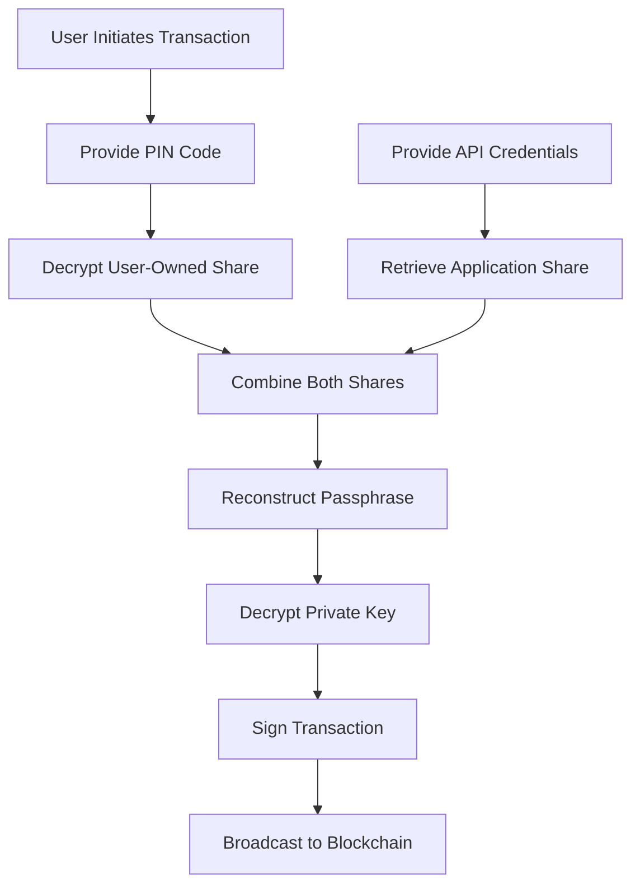

# Private Key Management

## Overview

Venly creates a private and public keypair whenever a Wallet is created. The `public key` is the wallet address (e.g. `0x123123123`) that is openly shareable, allowing anyone to send funds to it.

The `private key` acts as the "**password**" to access and control the wallet's funds. It should be kept secure and not shared with anyone to prevent unauthorized access to the wallet and its funds.

<Warning>
**Critical Information:**

Knowing the **private key** will give you access to all digital assets linked to this wallet. The private key is encrypted with a passphrase and securely stored in our system.
</Warning>

---

## Private Key Management Architecture

<Frame caption="Private Key Management">
  
</Frame>

The private key is first encrypted with a **random passphrase**. The passphrase is then split into **two different shares**, using the [Shamir Secret Sharing algorithm](https://en.wikipedia.org/wiki/Shamir's_secret_sharing).

---

## The Two Shares

### User-Owned Share

This share refers to the ownership exclusively held by the **user**. To further enhance security, this share undergoes an extra layer of **encryption** using a **secret** chosen by the user (such as the **PIN code** provided during wallet creation). Following this, the encrypted user-owned share is stored securely in a Key-Vault.

<Info>
**Enhanced Security:**

Because of the extra encryption, only the **user** can access this share. By providing the correct **PIN code** (or other signing method), the user can decrypt and use the **user-owned share** and **application share**, to access the private key.
</Info>

As a result, the security measures ensure that only the rightful user can decrypt and access the **private key**, safeguarding the wallet and its funds.

#### Key Features

<CardGroup cols={2}>
  <Card title="User-Exclusive" icon="user-lock">
    Only the user has access to decrypt this share
  </Card>
  
  <Card title="PIN-Protected" icon="lock">
    Encrypted with user's PIN code or signing method
  </Card>
  
  <Card title="Vault-Stored" icon="vault">
    Securely stored in a Key-Vault system
  </Card>
  
  <Card title="Double Encryption" icon="shield-halved">
    Additional layer of encryption for extra security
  </Card>
</CardGroup>

---

### Application Share

A share owned by Venly and securely stored in a Key-Vault. You receive this **share** along with a **Client ID and Client Secret**.

#### Key Features

<CardGroup cols={2}>
  <Card title="Venly-Managed" icon="server">
    Managed and secured by Venly infrastructure
  </Card>
  
  <Card title="Credentials-Protected" icon="key">
    Access requires Client ID and Client Secret
  </Card>
  
  <Card title="Vault-Stored" icon="vault">
    Securely stored in enterprise Key-Vault
  </Card>
  
  <Card title="API-Accessible" icon="plug">
    Retrieved through authenticated API calls
  </Card>
</CardGroup>

---

## Accessing the Private Key

To access the private key, ownership has to be proven of the **2 shares**. (User-owned and application share)

<Steps>
  <Step title="User Authentication">
    User provides their PIN code (or other signing method) to decrypt the **user-owned share**
  </Step>
  
  <Step title="Application Authentication">
    Application provides Client ID and Client Secret to retrieve the **application share**
  </Step>
  
  <Step title="Share Combination">
    Both shares are combined to reconstruct the **passphrase**
  </Step>
  
  <Step title="Key Decryption">
    The passphrase is used to decrypt the **private key**
  </Step>
  
  <Step title="Function Execution">
    The private key is used to execute requested functions (transfers, transactions, etc.)
  </Step>
</Steps>

<Info>
All shares are encrypted and securely stored in a "**Vault**" (Key Management system).
</Info>

---

## Shamir's Secret Sharing

Shamir's Secret Sharing is a cryptographic algorithm that provides the foundation for Venly's private key management.

### How It Works

<AccordionGroup>
  <Accordion title="Secret Division" icon="scissors">
    The algorithm divides a secret (in this case, the passphrase) into multiple parts called shares. No single share reveals any information about the secret.
  </Accordion>
  
  <Accordion title="Threshold Scheme" icon="check-double">
    A minimum number of shares (threshold) are required to reconstruct the original secret. With Venly, both shares are required (2-of-2 scheme).
  </Accordion>
  
  <Accordion title="Mathematical Security" icon="function">
    The algorithm uses polynomial interpolation in a finite field, making it mathematically impossible to reconstruct the secret without the required number of shares.
  </Accordion>
  
  <Accordion title="Perfect Security" icon="shield-check">
    Even if an attacker obtains one share, they gain no information about the secret. Both shares must be combined to access the private key.
  </Accordion>
</AccordionGroup>

### Security Benefits

<CardGroup cols={2}>
  <Card title="No Single Point of Failure" icon="network-wired">
    Neither party alone can access the private key
  </Card>
  
  <Card title="Distributed Trust" icon="handshake">
    Trust is distributed between user and Venly
  </Card>
  
  <Card title="Cryptographic Guarantee" icon="seal-check">
    Mathematical proof that one share reveals nothing
  </Card>
  
  <Card title="Flexible Recovery" icon="life-ring">
    Alternative signing methods provide recovery options
  </Card>
</CardGroup>

---

## Private Key Usage Flow

### Transaction Signing Process

<Steps>
  <Step title="Transaction Request">
    User initiates a transaction through your application
  </Step>
  
  <Step title="Authentication">
    User provides their PIN code; Application provides API credentials
  </Step>
  
  <Step title="Share Retrieval">
    Both shares are retrieved from their respective vaults
  </Step>
  
  <Step title="Key Reconstruction">
    Shares are combined to reconstruct and decrypt the private key
  </Step>
  
  <Step title="Transaction Signing">
    Private key signs the transaction
  </Step>
  
  <Step title="Broadcast">
    Signed transaction is broadcast to the blockchain
  </Step>
</Steps>

---

## Security Guarantees

<CardGroup cols={2}>
  <Card title="Encrypted at Rest" icon="lock">
    Private keys are never stored in plain text
  </Card>
  
  <Card title="Split Storage" icon="cut">
    Shares stored in separate secure vaults
  </Card>
  
  <Card title="Multi-Factor Auth" icon="shield-check">
    Requires both user and application authentication
  </Card>
  
  <Card title="Temporary Assembly" icon="clock">
    Private key assembled only when needed, never stored
  </Card>
</CardGroup>

---

## Exporting Private Keys

<Info>
You can always [export](https://docs.venly.io/docs/export-a-wallet) the private key of a created wallet if you like (e.g., provide it to the user).
</Info>

### When to Export

<AccordionGroup>
  <Accordion title="User Migration" icon="arrow-right-arrow-left">
    When users want to move their wallet to a different platform or self-custody solution
  </Accordion>
  
  <Accordion title="Backup Purposes" icon="floppy-disk">
    For users who want to maintain their own backup of their private key
  </Accordion>
  
  <Accordion title="Integration Requirements" icon="puzzle-piece">
    When integrating with third-party services that require direct key access
  </Accordion>
  
  <Accordion title="Regulatory Compliance" icon="gavel">
    When regulatory requirements mandate user access to private keys
  </Accordion>
</AccordionGroup>

### Export Considerations

<Warning>
**Security Warnings:**

When exporting private keys:
- Ensure secure transmission methods
- Educate users about private key security
- Warn about phishing and scam risks
- Recommend secure storage solutions
- Consider implementing additional confirmation steps
</Warning>

---

## Best Practices

### For Developers

<CardGroup cols={2}>
  <Card title="Secure Credentials" icon="key">
    Store Client ID and Secret securely using environment variables or secret managers
  </Card>
  
  <Card title="Implement Logging" icon="clipboard-list">
    Log all private key access attempts for security auditing
  </Card>
  
  <Card title="Rate Limiting" icon="gauge">
    Implement rate limiting on key access operations
  </Card>
  
  <Card title="Monitor Usage" icon="chart-line">
    Monitor unusual patterns in private key access
  </Card>
</CardGroup>

### For Users

<CardGroup cols={2}>
  <Card title="Secure PIN" icon="lock-keyhole">
    Choose strong, unique PIN codes
  </Card>
  
  <Card title="Multiple Methods" icon="key-skeleton">
    Set up multiple signing methods for recovery
  </Card>
  
  <Card title="Regular Backups" icon="floppy-disk">
    Keep emergency codes secure and backed up
  </Card>
  
  <Card title="Vigilance" icon="eye">
    Be aware of phishing attempts and scams
  </Card>
</CardGroup>

---

## Comparison with Other Methods

| Feature | Venly (SSS) | Traditional Custodial | Pure Self-Custody |
|:--------|:------------|:---------------------|:------------------|
| **User Control** | ✅ Shared | ❌ Platform controls | ✅ Full control |
| **Key Security** | ✅ Split & encrypted | ⚠️ Platform dependent | ⚠️ User responsible |
| **Recovery Options** | ✅ Multiple methods | ✅ Platform recovery | ❌ Limited |
| **Single Point of Failure** | ✅ No | ❌ Yes (platform) | ❌ Yes (user) |
| **Ease of Use** | ✅ High | ✅ High | ⚠️ Moderate |
| **Transaction Speed** | ✅ Fast | ✅ Fast | ⚠️ Variable |

---

## Technical Details

### Encryption Standards

<AccordionGroup>
  <Accordion title="Passphrase Encryption" icon="lock">
    - **Algorithm**: AES-256-GCM
    - **Key Derivation**: PBKDF2 with high iteration count
    - **Random IV**: Generated for each encryption operation
  </Accordion>
  
  <Accordion title="Share Encryption" icon="shield-halved">
    - **User Share**: Encrypted with user's PIN (via Argon2 key derivation)
    - **Application Share**: Protected by API authentication layer
    - **Storage**: AWS KMS-managed encryption keys
  </Accordion>
  
  <Accordion title="Vault Security" icon="vault">
    - **Provider**: HashiCorp Vault / AWS KMS
    - **Access Control**: Role-based access with audit logging
    - **Redundancy**: Multi-region replication for availability
  </Accordion>
</AccordionGroup>

---

## Learn More

<CardGroup cols={2}>
  <Card title="Pincode Management" icon="lock-keyhole" href="/getting-started/pincode-management">
    Learn about PIN code management strategies
  </Card>
  
  <Card title="Infrastructure Security" icon="shield" href="/getting-started/infrastructure">
    Understand Venly's security architecture
  </Card>
  
  <Card title="Export Wallet" icon="download" href="https://docs.venly.io/docs/export-a-wallet">
    Learn how to export private keys
  </Card>
  
  <Card title="Shamir's Secret Sharing" icon="book" href="https://en.wikipedia.org/wiki/Shamir's_secret_sharing">
    Deep dive into the algorithm
  </Card>
</CardGroup>
