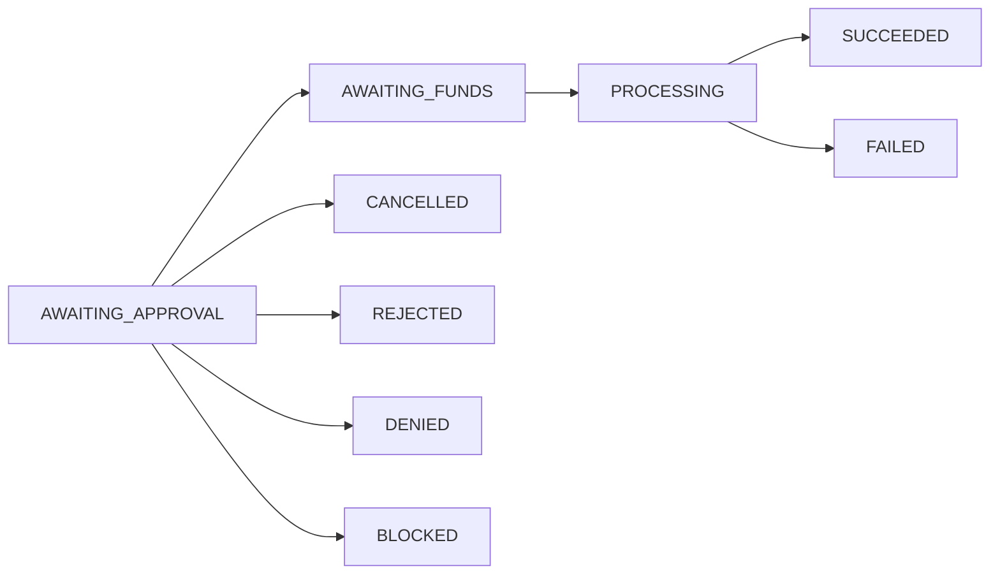

## Overview

Ramp requests are the core transactions in Fundflow that enable conversion between fiat currencies and cryptocurrencies.

<CardGroup cols={2}>
  <Card title="On-Ramp" icon="arrow-up">
    **Fiat → Crypto**: Convert fiat currency to cryptocurrency
  </Card>
  <Card title="Off-Ramp" icon="arrow-down">
    **Crypto → Fiat**: Convert cryptocurrency to fiat currency
  </Card>
</CardGroup>

---

## Prerequisites

Before creating ramp requests, ensure you have:

✅ **Company verified** (KYB completed)  
✅ **Bank account verified** (for receiving/sending fiat)  
✅ **Crypto wallet verified** (for receiving/sending crypto)  
✅ **Appropriate user role** (COMPANY_ADMIN or COMPANY_MANAGER)

---

## Ramp Request Lifecycle

### Status Flow



| Status | Description | Next Actions |
|--------|-------------|--------------|
| **AWAITING_APPROVAL** | Request created, pending approval | Approve, Reject, or Cancel |
| **AWAITING_FUNDS** | Approved, waiting for payment | Customer sends payment |
| **PROCESSING** | Payment received, conversion in progress | Wait for completion |
| **SUCCEEDED** | Transaction completed successfully | None |
| **FAILED** | Transaction failed | Review and retry |
| **CANCELLED** | Cancelled by requester | None |
| **REJECTED** | Rejected by company admin | None |
| **DENIED** | Denied by Venly admin | Contact support |
| **BLOCKED** | Blocked by Venly admin | Contact support |

---

## Creating On-Ramp Requests

### Process Overview

<Steps>
  <Step title="Create Request">
    Use the [Create Ramp Request](/api-reference/Fundflow-API/ramp-requests/create-a-new-ramp-request) endpoint
    
    ```json
    {
      "rampType": "ON_RAMP",
      "amount": 1000.00,
      "fiatCurrencyId": "uuid-of-eur",
      "cryptoCurrencyId": "uuid-of-usdc",
      "companyWalletId": "uuid-of-your-wallet"
    }
    ```
    
    The request is created in **AWAITING_APPROVAL** status
  </Step>
  
  <Step title="Approve Request">
    Use the [Approve Ramp Request](/api-reference/Fundflow-API/ramp-requests/approve-a-ramp-request) endpoint
    
    Status changes to **AWAITING_FUNDS**
    
    You'll receive deposit bank account details with a unique payment reference
  </Step>
  
  <Step title="Send Fiat Payment">
    Transfer the fiat amount to the provided Venly deposit bank account
    
    **Important**: Include the payment reference in your bank transfer
  </Step>
  
  <Step title="Processing">
    Once Venly receives the payment, status changes to **PROCESSING**
    
    The system converts fiat to crypto at the current exchange rate
  </Step>
  
  <Step title="Completion">
    Crypto is sent to your company wallet
    
    Status changes to **SUCCEEDED**
  </Step>
</Steps>

<Warning>
  **Always include the payment reference** in your bank transfer. This ensures proper matching of your payment to the ramp request.
</Warning>

### On-Ramp Example

```bash
# 1. Get available currency pairs
GET /v1/ramp-requests/on-ramp/pairs

# 2. Create on-ramp request
POST /v1/ramp-requests
{
  "rampType": "ON_RAMP",
  "amount": 1000.00,
  "fiatCurrencyId": "eur-currency-id",
  "cryptoCurrencyId": "usdc-ethereum-id",
  "companyWalletId": "your-wallet-id"
}

# 3. Approve the request
POST /v1/ramp-requests/{id}/approve
{
  "version": 1
}

# 4. Customer sends EUR 1000 to deposit account with payment reference
# 5. System processes and sends USDC to company wallet
```

---

## Creating Off-Ramp Requests

### Process Overview

<Steps>
  <Step title="Create Request">
    Use the [Create Ramp Request](/api-reference/Fundflow-API/ramp-requests/create-a-new-ramp-request) endpoint
    
    ```json
    {
      "rampType": "OFF_RAMP",
      "amount": 0.5,
      "cryptoCurrencyId": "uuid-of-usdc",
      "fiatCurrencyId": "uuid-of-eur",
      "companyBankAccountId": "uuid-of-your-bank-account"
    }
    ```
    
    The request is created in **AWAITING_APPROVAL** status
  </Step>
  
  <Step title="Approve Request">
    Use the [Approve Ramp Request](/api-reference/Fundflow-API/ramp-requests/approve-a-ramp-request) endpoint
    
    Status changes to **AWAITING_FUNDS**
    
    You'll receive the Venly deposit wallet address
  </Step>
  
  <Step title="Send Crypto Payment">
    Transfer the crypto amount from your company wallet to the Venly deposit wallet
  </Step>
  
  <Step title="Add Transaction Hash">
    Use the [Update Transaction Hash](/api-reference/Fundflow-API/ramp-requests/update-transaction-hash) endpoint
    
    ```json
    {
      "blockchainTransactionHash": "0x1234...",
      "version": 2
    }
    ```
  </Step>
  
  <Step title="Processing">
    Once blockchain confirms the transaction, status changes to **PROCESSING**
    
    The system converts crypto to fiat at the current exchange rate
  </Step>
  
  <Step title="Completion">
    Fiat is sent to your company bank account
    
    Status changes to **SUCCEEDED**
  </Step>
</Steps>

### Off-Ramp Example

```bash
# 1. Get available currency pairs
GET /v1/ramp-requests/off-ramp/pairs

# 2. Create off-ramp request
POST /v1/ramp-requests
{
  "rampType": "OFF_RAMP",
  "amount": 0.5,
  "cryptoCurrencyId": "usdc-ethereum-id",
  "fiatCurrencyId": "eur-currency-id",
  "companyBankAccountId": "your-bank-account-id"
}

# 3. Approve the request
POST /v1/ramp-requests/{id}/approve
{
  "version": 1
}

# 4. Customer sends 0.5 USDC to deposit wallet
# 5. Add transaction hash
PATCH /v1/ramp-requests/{id}/tx-hash
{
  "blockchainTransactionHash": "0x1234...",
  "version": 2
}

# 6. System processes and sends EUR to company bank account
```

---

## Managing Ramp Requests

### Listing Requests

Use the [List Ramp Requests](/api-reference/Fundflow-API/ramp-requests/list-all-ramp-requests) endpoint with filters:

```bash
GET /v1/ramp-requests?rampType=ON_RAMP&status=AWAITING_APPROVAL&page=1&size=50
```

**Available filters:**
- `rampType`: ON_RAMP or OFF_RAMP
- `status`: Filter by status
- `fromDate`: Start date (YYYY-MM-DD)
- `toDate`: End date (YYYY-MM-DD)
- `paymentReference`: Specific payment reference
- `sortOn`: Field to sort by
- `sortOrder`: ASC or DESC

### Getting Request Details

```bash
GET /v1/ramp-requests/{id}
```

Returns complete details including:
- Current status and timestamps
- Amount breakdown (fiat, crypto, fees)
- Exchange rate used
- Associated accounts/wallets
- Complete event history
- Payment information

### Modifying Requests

**Edit amount** (only in AWAITING_APPROVAL status):
```bash
PUT /v1/ramp-requests/{id}/amount
{
  "amount": 1500.00,
  "version": 1
}
```

**Cancel request** (requester, in AWAITING_APPROVAL):
```bash
POST /v1/ramp-requests/{id}/cancel
{
  "version": 1
}
```

**Reject request** (admin, in AWAITING_APPROVAL):
```bash
POST /v1/ramp-requests/{id}/reject
{
  "version": 1
}
```

---

## Optimistic Locking

Fundflow uses optimistic locking to prevent concurrent updates:

<Steps>
  <Step title="Include Version">
    Every update request must include the current `version` number
  </Step>
  
  <Step title="Version Conflict">
    If the version has changed (HTTP 409), another user modified the resource
  </Step>
  
  <Step title="Retry">
    Fetch the latest version and retry your operation
  </Step>
</Steps>

```json
// Version conflict response (HTTP 409)
{
  "success": false,
  "errors": [{
    "code": "OPTIMISTIC_LOCK_EXCEPTION",
    "message": "The resource has been modified. Please fetch the latest version and retry."
  }]
}
```

---

## Fees and Exchange Rates

### Fee Calculation

Fees are company-specific and may include volume tiers. Use the [Calculate Fee](/api-reference/Fundflow-API/fees/calculate-fee-for-a-ramp-request) endpoint:

```bash
POST /v1/fees/calculate
{
  "amount": 1000.00,
  "type": "ON_RAMP"
}
```

Response:
```json
{
  "success": true,
  "result": {
    "amount": 10.00,
    "percentage": 1.0
  }
}
```

### Amount Breakdown

For each ramp request:
- **Fiat Amount**: Total fiat amount (including fees)
- **Fiat Net Amount**: Net fiat after deducting fees
- **Crypto Amount**: Cryptocurrency amount
- **Fiat Fee Amount**: Fee in fiat currency
- **Fee Percentage**: Percentage applied
- **Exchange Rate**: Conversion rate used

---

## Exporting Requests

Export all ramp requests for accounting and auditing:

```bash
GET /v1/ramp-requests/export
```

Returns a downloadable file (CSV/Excel) with all transaction data.

---

## User Roles and Permissions

| Role | Create | Approve | Reject | Cancel | View |
|------|--------|---------|--------|--------|------|
| **COMPANY_ADMIN** | ✅ | ✅ | ✅ | ✅ | ✅ |
| **COMPANY_MANAGER** | ✅ | ❌ | ❌ | ✅ (own) | ✅ |
| **COMPANY_VIEWER** | ❌ | ❌ | ❌ | ❌ | ✅ |

---

## Best Practices

<Tip>
  **Check Currency Pairs**: Always verify available currency pairs before creating requests using the `/on-ramp/pairs` or `/off-ramp/pairs` endpoints.
</Tip>

<Tip>
  **Calculate Fees First**: Use the fee calculation endpoint to understand costs before creating large requests.
</Tip>

<Tip>
  **Track Payment References**: Save payment references for your records to easily match bank transfers with ramp requests.
</Tip>

<Warning>
  **Cannot Cancel After Approval**: Once a request is approved and moves to AWAITING_FUNDS, it cannot be cancelled. Ensure all details are correct before approving.
</Warning>

<Warning>
  **Blockchain Confirmations**: Off-ramp requests require blockchain confirmation before processing. This may take several minutes depending on network congestion.
</Warning>

---

## Troubleshooting

### On-Ramp Issues

**Request stuck in AWAITING_FUNDS?**
- Verify you sent the exact amount specified
- Confirm you included the payment reference
- Check if the bank transfer has been processed
- Contact support if payment was sent correctly

**Wrong amount sent?**
- Contact Venly support immediately
- Do not create a new request
- Provide transaction details for reconciliation

### Off-Ramp Issues

**Request not processing?**
- Verify you added the transaction hash
- Confirm the transaction is confirmed on the blockchain
- Check you sent to the correct deposit wallet address
- Ensure you sent the correct amount and token

**Wrong network used?**
- Contact Venly support immediately
- Provide transaction hash and details
- Do not send additional transactions

---

## API Reference

<CardGroup cols={2}>
  <Card title="Create Ramp Request" icon="plus" href="/api-reference/Fundflow-API/ramp-requests/create-a-new-ramp-request">
    Create new on-ramp or off-ramp
  </Card>
  <Card title="List Requests" icon="list" href="/api-reference/Fundflow-API/ramp-requests/list-all-ramp-requests">
    View all ramp requests
  </Card>
  <Card title="Approve Request" icon="check" href="/api-reference/Fundflow-API/ramp-requests/approve-a-ramp-request">
    Approve a ramp request
  </Card>
  <Card title="Currency Pairs" icon="arrows-left-right" href="/api-reference/Fundflow-API/ramp-requests/get-available-on-ramp-currency-pairs">
    Get available currency pairs
  </Card>
</CardGroup>

---

## Next Steps

<CardGroup cols={3}>
  <Card title="Fee Structure" icon="percent" href="/guides/payments/fees">
    Understand fee calculations
  </Card>
  <Card title="Account Management" icon="building-columns" href="/guides/payments/accounts">
    Manage bank accounts and wallets
  </Card>
  <Card title="Security" icon="shield" href="/guides/payments/security">
    Security best practices
  </Card>
</CardGroup>
